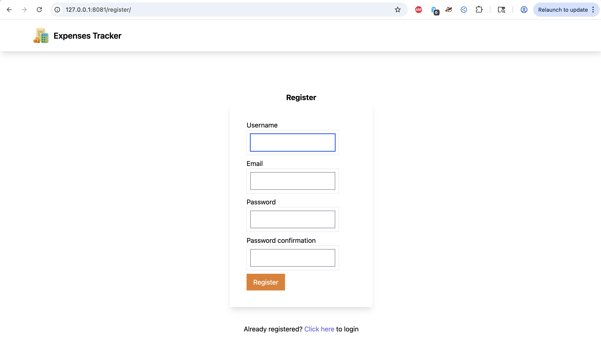
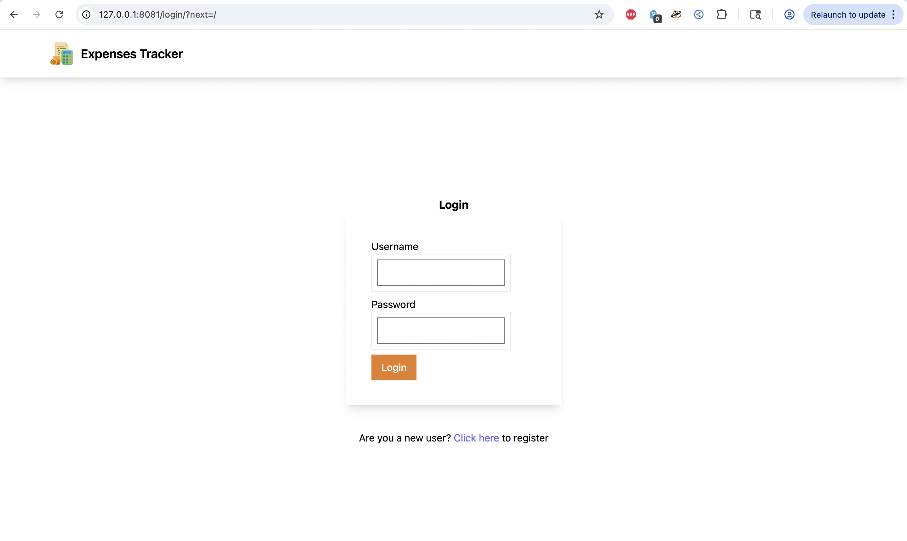

# 💰 Web-Based Expenses Tracker


A **web-based expenses tracker** built with **Python and Django** that helps users track, manage, and analyze their personal expenses through a clean and responsive interface.

This project is ideal for learning **full-stack development with Django** and personal finance management concepts.

---

## 🚀 Features

- ✅ Add, edit, and delete expenses  
- 📊 Categorize expenses (Food, Travel, Shopping, etc.)  
- 🔐 User authentication (Register / Login / Logout)  
- 📈 Dashboard to view spending insights  
- 📅 Track expense history  
- 📱 Responsive UI using Tailwind CSS  

---

## 🛠️ Tech Stack

**Backend**
- Python
- Django

**Frontend**
- HTML
- CSS
- Tailwind CSS
- JavaScript

**Database**
- SQLite (default Django DB – can be changed to PostgreSQL/MySQL)

---

## 📦 Requirements

- Python 3.8+
- Django 3.x+
- Node.js (optional for Tailwind build tools)

---

## 📂 Project Structure

```
webbasedexpensestracker/
│
├── mysite/                 # Django project root
│   ├── myapp/              # Expenses tracking app
│   ├── users/              # User authentication & profiles
│   ├── theme/              # Tailwind CSS setup
│   ├── mysite/             # Django settings & URLs
│   └── manage.py
│
├── requirements.txt
├── README.md
└── screenshots/            # App screenshots
```

---

## ⚙️ Installation & Setup

Follow these steps to run the project locally.

### 1️⃣ Clone the repository
```bash
git clone https://github.com/bellamkondasrikanth66/webbasedexpensestracker.git
cd webbasedexpensestracker
```

### 2️⃣ Create a virtual environment

```bash
python3 -m venv venv
source venv/bin/activate     # Mac/Linux
# OR
venv\Scripts\activate        # Windows
```

### 3️⃣ Install dependencies

```bash
pip install -r requirements.txt
```

### 4️⃣ Run migrations

```bash
cd mysite
python manage.py migrate
```

### 5️⃣ Create admin user (optional)

```bash
python manage.py createsuperuser
```

### 6️⃣ Run the server

```bash
python manage.py runserver
```

Open in browser:

```
http://127.0.0.1:8000/
```

---

## ▶️ Usage

1. Register or login
2. Add expenses with category & amount
3. View expense history
4. Analyze spending using dashboard
5. Manage expenses anytime

---

## 📸 Screenshots

### Registration Page


### Login Page


### Add Expense Page


### Dashboard


---

## 🤝 Contributing

Contributions are welcome!

1. Fork the repository
2. Create a branch (`git checkout -b feature-name`)
3. Commit changes (`git commit -m "Add feature"`)
4. Push (`git push origin feature-name`)
5. Open Pull Request

---

## 🧹 Recommended .gitignore

```
.DS_Store
venv/
__pycache__/
*.pyc
db.sqlite3
.env
```

---

## 📄 License

This project is licensed under the **MIT License**.

---

## 👨‍💻 Author

**Srikanth Bellamkonda**
GitHub: [https://github.com/bellamkondasrikanth66](https://github.com/bellamkondasrikanth66)

---

## ⭐ Support

If you like this project, please ⭐ star the repository!

---
