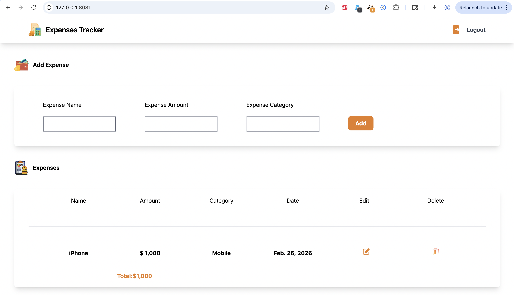

# 💰 Web-Based Expenses Tracker

A **web-based expenses tracker** built with **Python and Django** that helps users track, manage, and analyze their personal expenses efficiently through a clean and responsive interface.

This project is ideal for learning Django full‑stack development and personal finance management concepts.

---

## 🚀 Features

* ✅ Add, edit, and delete expenses
* 📊 Categorize expenses (Food, Travel, Shopping, etc.)
* 🔐 User authentication (Register/Login/Logout)
* 📈 Dashboard to view spending insights
* 📅 Track expense history
* 📱 Responsive UI using Tailwind CSS

---

## 🛠️ Tech Stack

**Backend**

* Python
* Django

**Frontend**

* HTML
* CSS
* Tailwind CSS
* JavaScript

**Database**

* SQLite (default Django DB – can be changed to PostgreSQL/MySQL)

---

## 📂 Project Structure

```
webbasedexpensestracker/
│
├── mysite/                    # Django project root
│   │
│   ├── myapp/                 # Main expenses tracking app
│   ├── users/                 # User authentication & profiles
│   ├── theme/                 # Tailwind CSS and UI styling
│   ├── mysite/                # Django settings, URLs, config
│   │
│   ├── db.sqlite3             # Default database
│   ├── manage.py              # Django management script
│   └── .DS_Store              # macOS system file (ignore)
│
├── README.md                  # Project documentation
└── .DS_Store                  # macOS system file (ignore)
```

---

## ⚙️ Installation & Setup

Follow these steps to run the project locally.

### 1️⃣ Clone the repository

```bash
git clone https://github.com/bellamkondasrikanth66/webbasedexpensestracker.git
cd webbasedexpensestracker/mysite
```

### 2️⃣ Create a virtual environment

```bash
python -m venv venv
```

Activate it:

**Windows**

```bash
venv\\Scripts\\activate
```

**Mac/Linux**

```bash
source venv/bin/activate
```

### 3️⃣ Install dependencies

```bash
pip install -r requirements.txt
```

*(If requirements.txt not present, install Django manually: `pip install django`)*

### 4️⃣ Run migrations

```bash
python manage.py migrate
```

### 5️⃣ Create admin user (optional)

```bash
python manage.py createsuperuser
```

### 6️⃣ Run the server

```bash
python manage.py runserver
```

Open in browser:

```
http://127.0.0.1:8000/
```

---

## ▶️ Usage

1. Register or login
2. Add your expenses with category & amount
3. View expense history
4. Analyze spending using dashboard
5. Manage expenses anytime

---

## 📸 Screenshots

*(Add screenshots here to showcase your UI)*

Example:

```

```

---

## 🤝 Contributing

Contributions are welcome!

1. Fork the repository
2. Create a branch (`git checkout -b feature-name`)
3. Commit changes (`git commit -m "Add feature"`)
4. Push (`git push origin feature-name`)
5. Open Pull Request

---

## 🧹 Recommended .gitignore

```
.DS_Store
venv/
__pycache__/
*.pyc
db.sqlite3
.env
```

---

## 📄 License

This project is licensed under the **MIT License**.

---

## 👨‍💻 Author

**Srikanth Bellamkonda**
GitHub: [https://github.com/bellamkondasrikanth66](https://github.com/bellamkondasrikanth66)

---

## ⭐ Support

If you like this project, please ⭐ star the repository and share it!
